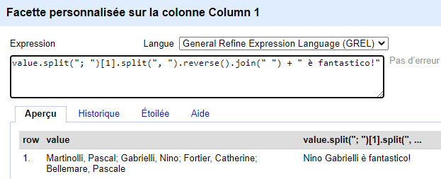

```{r setup, include=FALSE}
library(knitr)
library(rmdformats)

## Global options
options(max.print="75")
opts_chunk$set(echo=FALSE,
	             cache=TRUE,
               prompt=FALSE,
               tidy=TRUE,
               comment=NA,
               message=FALSE,
               warning=FALSE)
opts_knit$set(width=75)
```


 

</br>

***


# Objectifs

<div class = "right">

</div>

- Comprendre le fonctionnement du logiciel.
- Importer et explorer un jeu de données. 
- Manipuler et transformer des données.
- S'initier à l'usage du langage GREL et aux expressions régulières.
</br>
</br>
</br>
</br>
</br>

***


# 1. Préliminaires
## Des données bien ordonnées commencent par soi-même!


- Le nettoyage de fichiers de données est une tâche souvent longue et ennuyeuse mais incontournable avant toute analyse ou diffusion de données.

- L'ampleur de cette tâche dépendra de l'état des données et du type de logiciel qui sera ensuite utilisé à des fins d'analyse ou de visualisation (R, SPSS, Stata, Tableau, ArcGIS...)

</br>

#### Problèmes courants relatifs à la forme et/ou au contenu d'un jeu de données:

- Problèmes d'entêtes et de noms de variables.
- Cellules fusionnées, qui contiennent différentes informations.
- Variables qui ne sont pas clairement définies à la verticale.
- Contenu textuel non structuré.
- Problèmes de formats, de "petits caractères" -> séparateurs/délimiteurs de contenu et de colonnes, guillemets, encodage (''  || | "" , . ; )
- Présence de cellules vides, espaces...

[A case study in messy data analysis: the Australian same-sex marriage survey](https://blog.revolutionanalytics.com/2017/12/sex-marriage-survey.html)

<center>

{width=60%}  

</center>

</br>

***


Avant d'utiliser ses données dans le logiciel de son choix, le nettoyage de ses données peut donc inclure de nombreuses tâches comme:

<div class = "right">

</div>
- Modifier l'encodage.
- Supprimer les doublons.
- Diviser les cellules composées de valeurs multiples.   
- Recoder les valeurs manquantes.
- Repérer les erreurs de saisie, les valeurs aberrantes...
- Fusionner des fichiers.
- Fusionner des colonnes.
- Agréger des valeurs de variables.
- Créer des variables.
- Changer le format des variables.
- Changer le format du fichier.
- Transformer les colonnes en rangées (format "wide" en "long").

</br>

***


# 2. Pourquoi OpenRefine?

- Plusieurs langages de programmation et outils d'analyse ou de gestion de données peuvent être utilisés, mais OpenRefine a été créé spécifiquement pour faire le ménage!

- Plus facile que R et plus efficace qu'Excel.

- Permet de facilement identifier et de corriger en lot des données incomplètes, manquantes, erronées, incohérentes, non pertinentes, mal formatées, qu'elles soient numériques ou textuelles => sauve temps et énergie.


<center>   


</center>   


</br>

### Fonctions spécialisées pour:

- *Explorer* ses données sous tous ses angles (grâce à des filtres, tris, facettes, regroupements).   
- *Nettoyer* : repérer des erreurs, modifier le contenu des cellules...
- *Tranformer* : changer formats de ses variables, créer de nouvelles variables sur la base des colonnes présentes...
- *Enrichir* : fusionner des fichiers, importer des données en ligne (API, URLs), réconciliation (Wikidata et [autres sources externes](https://github.com/OpenRefine/OpenRefine/wiki/Reconcilable-Data-Sources))...
- *Automatiser* (réutiliser son historique de manipulations)

</br>

<div class = "note">

**À noter** 

OpenRefine n'est pas un outil d'analyse ou de visualisation et ne permet pas de créer un jeu de données à partir de zéro. Ce n'est pas un outil de remplacement mais complémentaire.

</div>


</br>

***


## 2.1. Exemples d'utilisation

Harmoniser, standardiser, uniformiser...

<center>  

   

</center>  

</br>

***


## 2.2. Pour avoir de belles données *tidy*

Permet d'appliquer les principes du [Tidydata](https://r4ds.had.co.nz/tidy-data.html) 

> “Tidy datasets are all alike, but every messy dataset is messy in its own way.” –– Hadley Wickham

</br>

**Trois principes de base:**

1. Chaque colonne est une **variable**.
2. Chaque ligne est une **observation**.
3. Chaque cellule à **une seule valeur**.

<center>  

 

</center>  

</br>

***


## 2.3.  Principales caractéristiques

- Logiciel gratuit et ouvert utilisé par une large communauté.

- Créé en 2010 (*Freebase Gridworks*), racheté par Google en 2010 (*Google Refine*), puis ouverture du code en 2012 et repris par communauté qui le déplace sur Github et devient *OpenRefine*.

- Multiplateformes: Windows, Mac, Linux.

- Interface semblable à un tableur comme Excel, mais dont le fonctionnement s'apparente plus à une base de données (par exemple les traitements sont séparés des données, ie les formules ne sont pas enregistrées dans les cellules mais dans un script).

- Associe la facilité d'usage d'un logiciel comme Excel à la puissance d'outils de programmation et d'algorithmes.

- Usage de l'**interface graphique** et/ou **scripts GREL** (*Google Refine Expression Language*): propose un ensemble de fonctions automatisées donc ne nécessite à la base aucune compétence en programmation ou analyse, mais l'usage du langage permet d'aller beaucoup plus loin.

- Particulièrement puissant pour le nettoyage de table de données avec du contenu textuel.

- **Reproductibilité**! Permet de garder un historique de toutes les manipulations effectuées sur ses données afin de les partager, de les réutiliser sur d'autres données...

</br>


***


# 3. Installation et fonctionnement général

- [Télécharger et dézipper](https://openrefine.org/download.html) le logiciel dans un dossier de son choix.

- Créé en langage Java [donc nécessite l'installation de Java (64 bits de préférence)](https://www.java.com/en/download/).

- Navigateurs à privilégier: Chrome, Opera, Edge. Firefox peut poser problème (ne fonctionne pas dans IE).  

- Le fonctionnement d'OpenRefine peut être un peu déroutant au départ car il n'y a pas d'installation en bonne et due forme comme pour un logiciel régulier.

- Pour démarrer le logiciel, cliquer sur le fichier `` `openrefine.exe` `` ou `refine.bat`. Il est utile de faire un clic-droit sur le fichier .exe pour l'épingler dans sa barre de tâches (sur Mac, déplacer l'icône OpenRefine dans le dossier d'applications et double cliquer sur celle-ci).

- Une fenêtre de commande noire s'ouvrira et lancera l'ouverture d'un onglet dans le navigateur web.  

- La fenêtre de commandes peut ensuite être ignorée mais NE PAS LA FERMER! Elle ne servira qu'à fermer la session de travail.  

- Si le navigateur ne s'ouvre pas automatiquement, saisir l'adresse http://127.0.0.1:3333/ ou http://localhost:3333 dans un onglet. 

<center>  

{width=80%}

</center>  

</br>

***


## 3.1. Travail local

- Repose donc sur deux composantes: un **serveur web local** et un **onglet de navigateur web** pointant vers l'adresse du serveur sur son poste.

- Le travail se fait dans un onglet de navigateur qui est une simple interface graphique pour interagir avec ce serveur local, mais **les données ne sont pas sur le "nuage"**.

- Travail local donc pas d'environnement collaboratif. 

- Les fichiers programmes se trouveront dans le dossier d'installation et les fichiers de projets dans le *workspace directory*.

- OpenRefine ne modifie pas le fichier original, il travaille à partir d'une **copie en mémoire stockée en archives** dans le répertoire de travail.

- Le projet est enregistré en format OpenRefine automatiquement dans le dossier de travail à toutes les 5 minutes ([peut être modifié](https://docs.openrefine.org/manual/running#jvm-preferences)).

- Le fichier de données une fois nettoyé pourra être exporté en différents formats et l'historique/syntaxe pourra être extrait en format JSON et enregistré dans un fichier .txt.

- Pour fermer la session de travail correctement, faire `Ctrl + c` dans fenêtre de commande (peut être nécessaire de le faire plus d'une fois) = enregistre le projet et ferme le serveur.

</br>

<div class = "note">
**À noter**  
- Permet de travailler sur de gros fichiers mais la taille possible est tout de même limitée, la performance peut devenir problématique à plusieurs centaines de milliers de lignes (tout dépendant du nombre de colonnes) donc pas vraiment développé pour faire du big data.
- Travaille avec 1Go de mémoire par défaut. À plus de 100 000 lignes, il peut être préférable d'[augmenter la mémoire](https://docs.openrefine.org/manual/installing#increasing-memory-allocation) de travail:  
  - Ouvrir le fichier refine.ini dans notepad et modifier la ligne REFINE_MEMORY = parametre.  
  - Par la suite lancer OR avec le fichier *refine.bat* et non *openrefine.exe *.   

</div>
</br>

***


## 3.2. Écran d'accueil

- À partir du menu de gauche, il est possible de `Créer un projet`, `Ouvrir un projet` (historique des projets enregistrés) ou `Importer un projet ` (archives .zip se trouvant dans le dossier de travail).   

- Pour changer la langue de l'interface au français, cliquer sur l'onglet `Langue` dans le menu de gauche.  

- Le fichier peut être créé à partir de différentes sources: `Cet ordinateur` (poste local), `Adresses web (URLs)`, `Presse-papier` (copié-collé), `Google data` (Google sheets)...) et en différents formats (.csv, .txt, .xml, .xls, .JSON, .zip et non tar... (certaines extensions permettent l'usage d'autres formats comme rdf).  

<center>  

  

</center>  

- Deux fichiers ou plus peuvent être importés en même temps. Les lignes seront importées une à la suite de l'autre selon l'ordre d'importation (une colonne permettant d'identifier le fichier source sera créée automatiquement). 

</br>

***


## 3.3. Historique des projets

- L'onglet `Ouvrir un projet` permet:
  - D'accéder et d'ouvrir tous les projets enregistrés localement.
  - D'éditer ses métadonnées.
  - D'accéder au dossier de travail (défini par défaut) où OpenRefine stocke les archives des projets enregistrés par le biais du lien `Parcourir le dossier de l'espace de travail`.

<center>  


</center>  

</br>

***


# 4. Créer un projet

- Pour ouvrir un fichier à partir de son poste, cliquer sur `Créer un projet` - > `Cet ordinateur` - > `sélectionner fichiers` sur son  poste -> `Suivant`.  

- Une fenêtre s'ouvre ensuite pour permettre de pré-visualiser son jeu de données et de modifier, si nécessaire, les options d'importation en fonction des caractéristiques du fichier de données: modification du format de fichier s'il n'a pas été identifié correctement (5), l'encodage des caractères [UTF-8] (6), le traitement des entêtes et premières lignes (9)...

</br>

  


## Exercice

<div class = "box1">
- Créer un nouveau projet en important un fichier à partir de son emplacement sur Github: https://github.com/CRLNP/openrefine 
  - Cliquer sur le fichier *Incidents métro-mtl.csv* -> Cliquer sur le bouton RAW -> copier l'adresse du navigateur.
  - Dans OpenRefine, Créer un projet -> Adresses web (URLs) -> coller le lien -> Suivant.
(Le fichier est aussi disponible sur le site [Données ouvertes Montréal](https://donnees.montreal.ca/societe-de-transport-de-montreal/incidents-du-reseau-du-metro)).     

- Explorer les options d'importation -> Porter une attention particulière aux options: `Supprimer les espaces` (8 -> cocher), 	`Utiliser le caractère	" pour fermer les cellules contenant les séparateurs de colonnes` (10 -> cocher ou non), `Analyser le texte des cellules comme nombres , dates…` (11 -> décocher)

- Changer le `Nom du projet` [2] et cliquer sur `Créer un projet` [4] - En cas de problème, il est possible de recommencer le processus [1].
</div>

</br>

***


# 5. Explorer l'interface

- L'interface est similaire à Excel mais on ne peut voir l'ensemble des lignes, la "logique" d'OpenRefine repose sur le travail en **colonnes**.

- OpenRefine propose deux vues des données: `lignes` et `entrées.` Les données sont généralement présentées en mode `lignes`, c'est-à-dire chaque ligne représente une observation. Le mode `entrées` permet d'associer plusieurs lignes à une observation.

- Il est donc possible de modifier la structure du fichier pour que plusieurs lignes soient associées à un seul cas en se basant sur la colonne clé (**seule la ligne originale sera numérotée**), mais doit se faire avec précautions. Pour les logiciels d'analyse, le format *tidy* (`lignes`) est à privilégier.

<center>  

 

</center>  

1. Lien sous l'icône renvoi vers la page d'accueil/importation.
2. Renommer le nom de son projet en tout temps.
3. Permalien qui permet de revenir à une vue précise (affichage, tri, facettes...) du projet.
4. Nombre de lignes/observations du fichier.
5. Changement du mode lignes ou observations.
6. Modifier le nombre de lignes affichées.
7. Passer d'une page à l'autre.
8. Ouvrir un nouvel onglet OpenRefine.
9. Exporter le fichier en différents formats.

</br>

***


## 5.1. L'édition de cellules

- Il est possible d'éditer manuellement le contenu de cellules individuelles en se plaçant sur chacune et en cliquant `edit`, mais OpenRefine privilégie le **travail en lot par colonnes** pour filtrer, trier, transformer.

- L'édition directe peut s'appliquer individuellement ou sur toutes les cellules avec la même valeur dans cette colonne.

- Permet également de modifier le format de la cellule.

<center>  

{width=80%}

</center>  


## Exercice

<div class = "box1">
- Dans la colonne *Cause primaire* cliquer dans une cellule *Autres*, éditer son contenu pour *autre* et appliquer à la cellule. 
- Dans la colonne *Porte*, modifier le format de n'importe quelle cellule à *Nombre* et appliquer à toutes les cellules identiques.
- Dans la colonne *Évacuation*, modifier le contenu d'une cellule "#" par *Non* et appliquer à toutes les cellules identiques.
</div>

</br>

***


## 5.2. Format des données  


#### Trois formats de base: 
  1. Chaîne de caractères
  2. Nombre
  3. Date (norme ISO-8601 YYYY-MM-DDTHH:MM:SSZ)*
  

  
#### Deux formats découlant d'actions: 
  - Erreur (format attribué suite à une erreur de transformation)  
  - Null**


#### Deux autres types particuliers découlant de manipulations
  - Booléen (valeur binaire T ou F)
  - *Array* (liste de valeurs séparées par une virgule entre crochets pouvant être transformées)

</br>

##### * Format date

- Selon les besoins, les dates peuvent être traitées sous forme de `texte`, de `nombre` ou `date` (le format date est surtout nécessaire pour les calculs de dates).
- Le format date repose sur une série d'outils et de  standards pour reconnaitre et convertir les valeurs originales en date. 
- Pour qu'une cellule soit reconnue comme date, elle sera transformée au format *ISO-8601-compliant*.
- Possible de modifier ce format pour qu'il soit plus facilement lisible à l'exportation.

</br>

##### ** Format "manquant"

- OpenRefine fait une distinction entre les **cellules vides avec espaces blancs** (qui ne sont pas vides!), les **valeurs vides** (chaine de longueur 0), et les **valeurs "null"** (type spécial qui n'est pas une chaine de caractères). Les *vides* et les *null* sont aussi considérés comme *Blank*.
- Plusieurs fonctions automatisées sous `Facettes` et `Éditer les cellules` permettent de gérer ces types de valeurs.

</br>

## Exercice

<div class = "box1">
**Transformer une colonne date de format caractère en format date**:  
- Dans la colonne *Jour calendaire*: `Menu -> Éditer les cellules -> Transformations courantes -> En date`    
</div>

</br>

<div class = "note">
- À l'importation d'un fichier, chaque cellule se verra attribuer un format. 
- Par défaut, le contenu des cellules est de format chaînes.  
- Le contenu des cellules reconnu comme numérique et date sera de couleur verte.  
- Le format peut être modifié de différentes façons: Bouton `edit`, `Transformations courantes`, Fenêtre GREL.  
- Ce format aura un impact sur les actions possibles.  
- Le changement de format par édition directe d'une cellule est une opération distincte de la transformation du contenu. La première opération arrive parfois à changer des formats que la transformation ne peut faire.
- Pour plus d'information sur les formats, voir la [documentation officielle](https://docs.openrefine.org/manual/exploring).  
</div>

</br>

***


## 5.3. La gestion des lignes et colonnes

#### La gestion des colonnes peut se faire:

- Sur chaque colonne: 
  - Fonctions sous `Éditer la colonne -> Déplacer ... / Renommer / Supprimer`   
  - Fonctions sous `Aperçu -> Masquer... `   

</br>

- Sur la colonne `Toutes`:     
  - `Éditer les colonnes -> Retrier-supprimer, gestion des valeurs consécutives`    
  - `Aperçu -> Afficher-masquer`...  

</br>

#### La gestion des lignes:

- La sélection de lignes peut se faire par le biais de filtres, facettes et autres manipulations personnalisées.  
- Il est aussi possible de marquer/étoiler des lignes en lot ou individuellement puis de créer une facette sur la colonne `Toutes` pour sélectionner les lignes marquées (`true`).  
- On peut ensuite supprimer les lignes filtrées: `Toutes -> Éditer les lignes -> Supprimer les lignes correspondantes`.  

</br>

## Exercice

<div class = "box1">
**Supprimer une colonne: **  
- Sur la colonne *Type d'incident* -> `Éditer la colonne -> Supprimer cette colonne`.  

**Supprimer plusieurs colonnes: **  
- Sur la colonne *Toutes* -> `Éditer la colonne -> Éditer/Supprimer les colonnes` -> *KFS* et *CAT*.  

</div>

***


## 5.4. Historique (Undo/Redo)

- Toutes les actions sont enregistrées (log de ses manipulations) et peuvent être annulées en reculant étape par étape dans l'historique.  
- La première action d'un historique est la création du projet.  
- Puisque l'historique fait partie du projet enregistré dans le dossier de travail, il ne disparait pas à la fermeture de la session. 
- L'historique peut être extrait en format JSON, copier/coller dans notepad et appliquer de nouveau.  

<center>  

{width=60%}

</center>  

**Attention!**

- Si on recule dans le temps et qu'on fait une modification, les étapes qui suivent dans l'historique disparaissent pour de bon.  

- Les manipulations relatives à l'affichage ne sont pas enregistrées dans l'historique, seulement les transformations. L'enregistrement automatique ne comprend donc pas les facettes et filtres (vue de l'interface) - perd ce qui n'apparait pas dans le `Défaire/Refaire`.

- L'édition directe dans les cellules apparait dans l'historique mais ne peut être exportée.  

- Facettes et filtres s'enregistrent grâce au `permalien`.  

</br>

***


# 6. Menu et types de fonctions

Open Refine permet de travailler de **deux façons**:  


1. Avec l'ensemble des **fonctions automatisées** que l'on retrouve dans les menus.

2. En rédigeant ses propres [expressions](https://docs.openrefine.org/manual/expressions) avec le **langage GREL**.  

  - Même lorsque l'on utilise les fonctions automatisées, il est possible d'en modifier le fonctionnement en éditant directement la syntaxe GREL correspondante. 

</br>

## 6.1. Utiliser les fonctions automatisées:

- Le menu et l'ensemble de ses fonctions automatisées apparaissent en cliquant sur la flèche de l'intitulé de chaque colonne.

- Les fonctions disponibles sous le menu de la première colonne `Toutes` se distinguent des autres puisqu'elles permettent d'appliquer des fonctions à l'ensemble des colonnes du fichier: Marquer, étoiler, supprimer, masquer...

</br>

**Menu et fonctions de la colonne `Toutes`**


{width=90%}

</br>

**Menu et fonctions de chaque colonne-variable**

</br>

{width=90%}

</br>

***

## 6.2. Écrire ses fonctions avec GREL

</br>

Expressions similaires aux formules Excel mais qui s'appliquent aux colonnes, non aux cellules, et qui ne sont pas stockées à même les données mais dans un script.  

</br>


</br>

#### Le langage GREL peut s'utiliser de différentes façons:  

- En créant des facettes personnalisées : `Facette -> Facette textuelle personnalisée`.  

- En transformant une colonne: `Éditer les cellules -> transformer` (aussi sous `Toutes -> Transformer`).  

- En créant une nouvelle colonne: `Éditer la colonne -> Ajouter une colonne basée sur cette colonne`.  

</br>

**Les filtres et les transformations plus complexes peuvent aussi nécessiter l'usage d'[expressions régulières (regex)](https://regex101.com/)**

</br>

***


## 6.3. Trier un fichier

- Les données apparaissent dans l'ordre du fichier original.
- Pour modifier l'ordre d'apparition des observations, appliquer un ou des tris sur les colonnes avec `Trier...`
- Pour combiner plusieurs tris sur différentes colonnes: Faire un trie sur une colonne puis sur une autre en modifiant si nécessaire l'option `Trier selon cette seule colonne`.
- Les tris ne sont que temporaires et n'affectent donc que l'affichage. Pour qu'ils soient permanents (renumérotation des lignes): `Trier -> Retrier les lignes de façon permanente`*.  
- Il est possible de supprimer et d'inverser le tri à partir des options sur chaque colonne ou grâce à la fonction `Trier` du haut.  

 *Le tri permanent affecte tout le fichier, pas seulement la vue filtrée.  

 

## Exercice

<div class = "box1">
- Trier les valeurs de la colonne `Jour calendaire` en `date antéchronologique`.  
- Quelle est la dernière date d'incident enregistrée dans le fichier ?  
- Supprimer le tri.  
</div>
</br>

<div class = "box1">
- Trier les valeurs des cellules comme texte de la colonne `Mois Calendrier` .   
- Trier les valeurs des cellules comme texte de la colonne `Jour du mois`.  
- Explorer le résultat...   
- Supprimer le tri et recommancer la procédure avec un tri de format nombre.  
</div>

</br>

***


## 6.4. Filtrer le texte

- La fonction `Filtrer le texte` permet de chercher une ou des chaines de caractères dans une ou plusieurs variables.  
- Permet de rechercher des chaines de caractères dans une colonne et de combiner des filtres appliqués sur plusieurs colonnes pour raffiner la recherche.  
- Fonction plus expéditive que les facettes quand on ne veut que chercher une chaine de caractères.  
- L'affichage des lignes se limitera au nombre de cas correspondants aux critères de recherche inscrits dans les boites de filtres.  
- **Tant que les filtres seront actifs, les actions subséquentes se limiteront à ces cas filtrés.**  

 

## Exercice

<div class = "box1">
- Filtrer le texte sur la colonne *Code de lieu*: "berri"  
- Filtrer le texte sur la colonne *Heure de l'incident*: "12"  
- Explorer les résultats  
- Comment s'assurer d'avoir seulement les cas survenus entre 12h et 13h? Combien de lignes correspondent à ces conditions?^[12: ou expression rationnelle ^12]  
- Supprimer tous les filtres.
</div>

</br>

***


# 7. Les facettes

## 7.1 Caractéristiques

<div class = "right">

</div>

- Les facettes constituent la marque de commerce d'OpenRefine, d'où le logo! 

- Fonctionnalité puissante qui permet d'explorer et de filtrer ses données en fonction de différentes conditions.  

- N'affectent pas directement les données, seulement la présentation.  

- À la base, une facette correspond à la liste des valeurs possibles d'une variable  (et de leur occurrence) présentée selon le format (chaine, numérique, date).  

- Permettent une exploration et manipulation des valeurs possibles et de leurs cas correspondants plus élaborées que les filtres.  

- On peut ainsi identifier les tendances, les régularités, les erreurs, les écarts, les répétitions et  cibler les valeurs de sous-groupes précis.  

- Ces sous-groupes peuvent ensuite être édités et exportés (bouton `Exporter` en haut à droite). 

</br>

### Deux types de facettes:

  - Les facettes automatisées **[1]**.   
  </br>
  - Les facettes personnalisées **[2]**.  
  </br>
    - Il est aussi possible de créer ses propres facettes grâce au langage GREL pour définir des conditions de sélection/filtre très précises **[3]** (on parle encore ici de *facettes personnalisées*, mais elles doivent être rédigées manuellement).

</br>

<center>  


</center>  
    - **[8]** Le lien `changer` permet d'ouvrir une fenêtre d'édition GREL pour modifier la syntaxe de la facette.  
    - **[9]** Pour supprimer les facettes, cliquer sur le x de chaque fenêtre ou `Tout supprimer`.  
    - Pour conserver les fenêtres mais supprimer les sélections qui y ont été faites, cliquer sur `réintialiser` sur chaque fenêtre ou `Tout réinitialiser` **[9]**.  
    - **[10]** Option `Groupe`: Outils proposant différents algorithmes de similarité permettant de regrouper des catégories semblables.  


### Trois formats de facettes:

On retrouve également différents **formats de facettes** -> une pour chaque format de données (Les facettes personnalisées proposent aussi des facettes booléennes).   


#### 1. Facette textuelle **[4-5]** 

- Type de facette le plus souvent utilisé.   
- Regroupent dans la fenêtre de gauche les valeurs distinctes (textuelles ou numériques) des colonnes voulues.   
  - On peut faire une facette textuelle sur une colonne numérique mais pas l'inverse.  
  - 2000 valeurs maximum par défaut mais peut être modifié dans les préférences. Si les valeurs sont trop nombreuses, elles ne seront pas listées (un filtre pourrait être utilisé). 
- Permettent de combiner différents filtres en sélectionnant différentes valeurs d'une ou plusieurs variables (et leurs cas correspondants).   
  - Cliquer `inclure` ou `exclure` pour sélectionner ou supprimer des choix multiples **[12]**.   
  - Une fois la sélection faite, l'option `inverser` permet de sélectionner tout SAUF la sélection **[11]**.   
  - Peuvent être triées selon le nom ou le compte (nombre d'occurrences).   
- Permettent **d’éditer les valeurs** (contenu de chaque cellule correspondante) **[13]**.  


#### 2. Facette numérique **[7]**

- Visualiser et sélectionner les valeurs d’une variable numérique allant de la plus petite à la plus grande.  


#### 3. Facette chronologique **[6]**

- Visualiser et sélectionner les valeurs d’une colonne date en ligne du temps.  


</br>

## Exercice

<div class = "box1">

**Filtrer** 

- Explorer les valeurs de la variable *Cause primaire*. Quelle est la deuxième plus fréquente? 
- Quelles sont les catégories de *Cause secondaire* reliées à la *Cause primaire "Clientèle"*?   
- Quelle est la plus fréquente? Sélectionner cette valeur. Combien de cas correspondent à cette sélection?  
- À quel *jour de la semaine* cette cause est-elle survenue le plus souvent?^[Clientèle / Blessée ou malade, Méfait volontaire, Nuisance involontaire / Méfait volontaire 781/ 5]   
- Réinitialiser toutes les facettes.

**Éditer**  

- Dans la facette *Cause primaire*, renommer la valeur #ND -> NA.  
- Corriger la valeur "autre" pour qu'elle soit fusionnée à la valeur "Autres".  
- Supprimer toutes les facettes.
</div>

</br>


<div class = "box1">
**Filtrer** 

- Quel est le *symptome* le plus fréquent? Sélectionner cette valeur.  
- Sur quelle *Ligne* ce *symptome* s'est produit le plus souvent? Sélectionner cette valeur.  
- Ces événements ont-ils nécessité une *évacuation*?^[Clientèle / Ligne orange / Oui 17]     

**Éditer**  
- Éditer la variable *évacuation* de façon à ce qu'il n'y ait que **deux valeurs** possibles: Oui et Non.  
</div>

***


## 7.2. Les regroupements (clustering)

- Fonction qui permet d'identifier dans une colonne les valeurs distinctes qui pourraient avoir la même signification ou qui pourraient être regroupées dans une même catégorie = "variations sur le même thème" évaluées en fonction de [différents algorithmes](https://github.com/OpenRefine/OpenRefine/wiki/Clustering-In-Depth). 

- Chaque suggestion doit être approuvée individuellement pour que les modifications s'appliquent (les regroupements proposés ne sont pas nécessairement pertinents).

- OpenRefine propose des *clusters* selon différentes méthodes plus ou moins élaborées (*Proche voisin* prend plus de mémoire) qui permettent de regrouper les valeurs similaires et proposent des matchs possibles (*fuzzy matching*): par exemple *empreinte* est plus conservateur (distingue casse, espaces, ordre, répétition, ponctuation...), *ngram* est plus flexible (mêmes caractères), *Metaphone3* est le plus "libéral" (même prononciation).

## Exercice

<div class = "box1">
- Créer une facette textuelle sur la colonne *Code de lieu*.  
- Cliquer sur `Groupe` et explorer les regroupements en fonction des différents algorithmes.  
</div>

***


## 7.3. Les facettes personnalisées 


- Fonctionnent comme des facettes automatisées sauf qu'on ne peut éditer en fonction de ces résultats car elles présentent des données modifiées en mémoire.

- Ont été développées et automatisées afin d'explorer des aspects précis des données sans avoir à les  rédiger en syntaxe GREL: 

  - `Facette par mot` : Divise chaque mot (séparé d'un espace) d'une colonne et les présente en liste de valeurs distinctes [value.split(" ")].
  
  - `Facette doublons`: valeurs booléennes indiquant si les valeurs sont uniques (false) ou non (true) [facetCount(value, 'value', 'Symptome') > 1].  
  
  - `Facettes logarithmiques`: modification logarithmique de valeurs numériques [value.log()].
  
  - `Facette longueur de texte`: liste le nombre de caractères du contenu des cellules d'une colonne [value.length()].
  
  - Facettes permettant d'explorer les valeurs d'`erreur`, `nulles`, `vides`... [isEmptyString(value)]

*** 


# 8. Le langage GREL 


- *Google Refine Expression Language* 
- Langage similaire à javascript et formules excel.    
- Permet la rédaction d'expressions visant à manipuler/transformer le contenu des cellules d'une colonne.  
(Voir la [documentation officielle](https://docs.openrefine.org/manual/grel) pour plus de détails)  
- Langage composé de [fonctions](https://docs.openrefine.org/manual/grelfunctions) et d'[objets](https://docs.openrefine.org/manual/expressions#variables).

</br>

###  8.1. GREL - Principes de base 

#### Utilise une syntaxe particulière pour cibler les objets (variables):  
- Contenu de colonne actuelle: `value`.     
- Contenu d'une autre colonne: `cells['nom-colonne'].value`.    
- Contenu textuel: "guillemet simple ou double".    

</br>

#### Deux formats de notation:  
- Imbriquée: (trim(toLowercase(value)).    
- **Séquentielle**: value.toLowercase().trim() (plus facile à lire).    

</br>

#### Différents types de fonctions:  
- Les fonctions et leur comportement dépendront du type de données manipulées.  
- [Certaines fonctions](https://docs.openrefine.org/manual/grelfunctions#slicea-n-from-n-to-optional) permettent de transformer le contenu de cellules en `arrays` (liste d'éléments) et de les manipuler.  
- [Certaines fonctions](https://docs.openrefine.org/manual/expressions#regular-expressions) permettent d'utiliser les [expressions régulières](#expression).  

</br>

#### Différents types d'opérateurs:  
Selon le format, différents types d'**opérateurs** peuvent être utilisés entre les valeurs:  
	- Opérateurs arithmétiques: +, -, *, /  
	- Opérateurs booléens: ==, >, <  
  
**Par exemple:**

- Le "+" entre deux contenus numériques = somme


- Le "+" avec un contenu textuel = concaténation


</br>

***  

###  8.2. GREL - L'indexation, la sélection et la manipulation d'éléments:  

- Chaque caractère composant la valeur d'une cellule est ordonné dans un index **à partir de 0** (1er élément).
- Chaque élément d'un *array* est ordonné dans un index **à partir de 0** (1er élément) et peut être ciblé grâce aux `[ ]`.  
- L'opérateur `[ ]` permet de cibler/sélectionner des chaines de caractères ou des sous-éléments spécifiques. 

> `value[0,8]` -> Montréal (Québec) = ?   
> `value.split("(")[1]` -> Montréal (Québec) = ?  
> `value.split("(")[1].split(")")[0]` -> Montréal (Québec) = ?^[Montréal / Québec) / Québec]  

</br>

## Exercice

<div class = "box1">

`ISBN: 978-2-13-082930-0`

Comment conserver seulement le chiffre de l'ISBN dans les traits d'union?^[value[5,24].replace("-", "")]

Indices: `value` et fonction `.replace`

</div>

**Exemple 1**

`Martinolli, Pascal; Gabrielli, Nino; Fortier, Catherine; Bellemare, Pascale`


Éditer les cellules -> Transformer -> `value.split("; ").sort().join("; ")` 


- `split()`: divise la cellule en éléments distincts sur la base du séparateur ;
- `sort()`: tri les éléments
- `join()`: les joints avec le séparateur ;

</br>

**Exemple 2**   

Éditer les cellules -> Transformer -> `value.split("; ").slice(1).join("; ")` 


- `slice()` : conserve les éléments à partir de l'élément 1 donc supprime le 0. 

</br>

**Exemple 3**

Éditer les cellules -> Transformer -> `value.split("; ")[1].split(", ").reverse().join(" ") + " est le meilleur"` 



- `split()`: divise la cellule en éléments distincts sur la base du séparateur ;
- `slice()`: retient le deuxième élément
- `split()`: divise cet élément sur le séparateur ,
- `reverse()`: inverse l'ordre des deux éléments
- `join()`: rattache les deux éléments divisé avec un espace

</br>

## Exercice

<div class = "box1">

Créer une facette sur la colonne *Code de lieu* pour identifier les cas dont la valeur commence par "Côte"  

`value.startsWith(“Côte”)`    

</div>

</br>

<div class = "box1">

Créer une facette pour identifier les cas dont la valeur dans la colonne *Cause primaire* est la même que dans la colonne *Cause secondaire*

`value == cells["Cause secondaire"].value`   

</div>

</br>

<div class = "box1">

Créer une facette pour lister les cas selon l'*heure de l'incident* seulement, sans les minutes (2 premiers caractères). Comment faire afficher les minutes seulement?^[value[3,5] ou value.substring(3)] 

`value[0,2]`   


</div>

</br>


***


# 9.  Transformations

- OpenRefine permet d'explorer mais aussi de modifier ses données sans avoir à toucher au contenu de cellules manuellement.  

- Comme pour les facettes, les fonctions de transformation peuvent se faire de deux façons:    

  1. Transformations automatisées (`Transformations courantes`) **[2]**: fonctions permettant d'appliquer des modifications courantes sur le format et la structure des cellules/colonnes.  
  
  2. Transformations manuelles dans la fenêtre GREL **[1]** afin d'aller beaucoup plus loin.  
  


</br>

<div class = "note">
Pour voir la syntaxe correspondant à chaque fonction de `transformations courantes`, appliquer la fonction sur une colonne puis aller voir l'historique. Par exemple: `value.toNumber()`, `value.toTitlecase()`, `value.toNumber()`, `value.toUppercase()`, `value.trim()`... </div>

***

## 9.1. Créer et copier des colonnes

</br>

`Éditer la colonne -> Ajouter une colonne en fonction de cette colonne`


## Exercice

<div class = "box2">
Créer une nouvelle colonne sur la base de la colonne *Jour de la semaine* indiquant si le jour est en semaine ou fin de semaine.
</div>
<div class = "box1">
`if(value > 5,"fin de semaine","semaine")`
</div>

</br>

<div class = "box2">
Créer une colonne à partir de la colonne *heure de l'incident* en ne conservant que l'heure, sans les minutes, et rajouter la lettre h pour donner par exemple ceci: 15:12  ->  15h.  
</div>
<div class = "box1">
`value.split(':')[0] + "h"`.  

Ou

`value.splitByLengths(2)[0]`.  
</div>

</br>

*** 


## 9.2. Diviser le contenu de cellules multivariées

- **Deux options: **  
  1. En divisant le contenu des cellules en **plusieurs colonnes**: `Éditer la colonne -> Diviser en plusieurs colonnes`  
  2. En divisant le contenu sur **plusieurs lignes**: `Éditer les cellules -> Diviser les cellules multivariées`  

</br>

  

- La première option est la plus fréquente. 
- La deuxième option aura un effet important sur la structure des observations puisqu'elle multipliera le nombre de lignes par cas (ce qui nécessitera de passer à la vue par `entrées`).

## Exercice

<div class = "box2">
Transformer la variable *Ligne*
</div>
<div class = "box1">
**Uniformiser le nom des lignes:**  

- Créer une facette sur la colonne Ligne. 

- Deux problèmes se posent: 1) les noms de lignes non uniformes et 2) les valeurs multiples.  

- Nous choisissons d'uniformiser les valeurs en utilisant les numéros de lignes et en supprimant le mot Ligne.  

- Explorer et accepter les regroupements proposés avec la fonction `Groupe`.  

- Supprimer le mot ligne:  

  - `Éditer les cellules -> remplacer` -> "Ligne" par: ne rien saisir dans l'encadré.    

- Cliquer ensuite directement sur `edit` sur une cellule de la colonne de *Ligne* -> remarquer la présence d'un espace, supprimer l'espace et fermer. 

- Rafraichir la facette et observer l'impact. 

- Remarquer l'impact de l'espace dans la facette. Ces espaces peuvent être supprimés grâce à la fonction: `Éditer les cellules -> Transformations courantes -> Supprimer les espaces de début et de fin`.   
- Remplacer les couleurs de ligne par leur numéro directement dans la facette.   
</div>


<div class = "box1">
**Diviser le contenu des cellules en créant des colonnes avec une seule valeur  **

- Dans la facette, remplacer les "-" par des ",".    

- `Éditer la colonne -> Diviser en plusieurs colonnes`:
  - Définir le séparateur "," (celui-ci disparaitra).  
  - Décocher les options "Deviner" et "Supprimer".  
- Les nouvelles colonnes reprendront le nom de l'original numéroté. Les renommer: premiere, deuxieme, troisieme, quatrieme.  
</div>

</br>

<div class = "box2">
Diviser par les longueurs de champs la colonne `Numéro d'incident` pour en créer deux nouvelles:  
  1. Une colonne contenant le premier caractère indiquant le type d'incident, soit T (train) ou S (service).  
  2. Une colonne contenant l'ensemble des caractères numériques indiquant le numéro d'incident.  
</div>
<div class = "box1">
**Vérifications préalables:**
  1. Vérifier qu'il n'y a pas de doublon dans cette colonne: `Facettes personnalisées -> Facette doublon` -> Quel est le problème?  Cliquer sur `Changer` et analyser l'expression.  
  2. Vérifier la longueur de chaque cas:  `Facettes personnalisées -> Facette longueur du texte`.    

**Diviser la colonne:**  
- `Éditer la colonne -> Diviser en plusieurs colonnes selon les longueurs de champs` : 1, 8.    
- Décocher : deviner le type de cellule et Supprimer cette colonne.    
- Renommer les colonnes : Type et ID.    
</div>

</br>

***

</br>

### Rechercher/remplacer un caractère dans toutes les colonnes avec GREL

## Exercice

<div class = "box2">
Remplacer les valeurs "#" dans toute la base de données par "aucun"**   
</div>
<div class = "box1">
- Quel problème ce remplacement peut-il provoquer?    
- Explorer l'impact des trois expressions de remplacement suivantes:  

1. `value.replace("#", "aucun")`   
(remplace le caractère #: aucun et aucunN/D )     
 
2. `if(value.contains("#"),"aucun", value)`   
(remplace les cellules des # et #ND par aucun)  

3. `if(value==("#"),"aucun", value)`     
(remplace seulement les cellules #, pas les #ND par aucun) 
</div>

</br>

***


## 9.3. Fusionner le contenu de plusieurs colonnes

### Défit   
Nous souhaitons calculer la durée des incidents. Pour ce faire nous créerons deux colonnes:  
- Une colonne fusionnant les colonnes: *Année civile*, *Mois calendrier*, *jours du mois* et *Heure de l'incident*.  
- Une colonne fusionnant les colonnes: *Année civile*, *Mois calendrier*, *jours du mois* et *Heure de l'incident*.  

</br>

<div class = "note">
Lorsque l'on fusionne des colonnes, il faut porter une attention particulière au séparateur choisi. Ne pas utiliser un caractère qui pourrait faire partie du contenu (ex: ,) ou qui servira à diviser les colonnes (.csv)
</div>

</br>

## Exercice

<div class = "box2">
1. **Fonction automatisée** -> Fusionner les colonnes: *Année civile*, *Mois calendrier*, *jours du mois* et *Heure de l'incident*
</div>

<div class = "box1">
- Année civile -> `Éditer la colonne` -> `Joindre les colonnes`.    
- Joindre des colonnes -> Cocher les colonnes voulues.  
- Séparateur entre le contenu de chaque colonne: "-".    
- Écrire le résultat dans une nouvelle colonne nommée: *Date*.    

- Transformer en format date: `Éditer les cellules -> Transformations courantes -> En date`.    
</div>

</br>

<div class = "box2">
2. **Fenêtre GREL** -> Fusionner les colonnes: *Année civile*, *Mois calendrier*, *jours du mois* et *Heure de reprise*
</div>

<div class = "box1">
- Année civile -> Éditer la colonne -> Ajouter une colonne en fonction de cette colonne:  

`cells["Année civile"].value + "-" + "0" + cells["Mois calendrier"].value + "-" + "0" + cells["Jour du mois"].value + " " +  cells["Heure de l'incident"].value`.  

- Vérifier la transformation avec une facette `value.type()`.  

- Recommencer la jointure pour créer une colonne avec la date-heure de fin de l'incident
`cells["Année civile"].value + "-" + "0" + cells["Mois calendrier"].value + "-" + "0" + cells["Jour du mois"].value + " " +  cells["Heure de l'incident"].value`.  

- Transformer en format date: `Éditer les cellules -> Transformations courantes -> En date`.  
</div>

</br>

<div class = "box2">
Calculer la durée de l'incident  
</div>
<div class = "box1">

- Créer une nouvelle colonne vide:  
`Edit Column > Add Column Based on This Column ` -> Choisir un nouveau nom et le contenu: "".  

- Pour calculer une différence entre date: `diff(date1, date2, "results format")`.    

`diff(cells['date2'].value,cells['date1'].value, 'minutes')`.   
</div>

</br>

***


# 10. Les expressions régulières {#expression}

</br>

- L'usage de GREL permet des manipulations de données beaucoup plus avancées que l'utilisation des fonctions automatisées, mais OpenRefine permet en plus de combiner l'utilisation des expressions régulières avec GREL pour en augmenter la puissance. 
- Les expressions régulières permettent, à partir d'une syntaxe spécifique, d'identifier des patterns dans un contenu.  
- Lorsqu'utilisées avec GREL, ces expressions permettent donc d'identifier et d'extraire des contenus très précis pour ensuite les manipuler selon les besoins.  
- Elles peuvent être utilisées à différents endroits dans OpenRefine et doivent toujours être entourées de `/ /`: filtres, facettes, fenêtre GREL.
- Certaines expressions peuvent s'écrire en GREL avec ou sans regex.  

</br>


- Mais certaines fonctions (comme `match`) n'acceptent que ces expressions.  
</br>

<div class = "note">

Les expressions régulières peuvent être utilisées avec plusieurs autres langages dont [R](https://towardsdatascience.com/a-gentle-introduction-to-regular-expressions-with-r-df5e897ca432) et [Python](https://docs.python.org/3/howto/regex.html) et dans des logiciels qui n'ont rien à voir avec les statistiques comme [OpenOffice](https://wiki.openoffice.org/wiki/Documentation/How_Tos/Regular_Expressions_in_Writer).

Pour en savoir plus:  
- https://github.com/OpenRefine/OpenRefine/wiki/Understanding-Regular-Expressions  
- https://regex101.com/  

</div>

</br>

***

### La syntaxe de base:   

La syntaxe est composée d'éléments permettant de  cibler des caractères précis et de définir leur emplacement et leur occurrence.

+-------------------------------------------------------+------------------------------------------------+
| TYPES DE CARACTÈRES                                   | QUANTIFICATEURS ET EMPLACEMENT                 | 
+=======================================================+================================================+
| `.` : N’importe quoi                                  | `+` : 1 ou plus                                 |  
+-------------------------------------------------------+------------------------------------------------+
| `\w` : n'importe quel mot, chiffre ou _    (`\W` : sauf)                       | `*` : 0 ou plus                                 |    
+-------------------------------------------------------+------------------------------------------------+
| `\d` : Chiffres      (`\D` : sauf)                    | `?` : 0 ou un                                   |   
+-------------------------------------------------------+------------------------------------------------+
| `\s` : Espaces         (`\S` : sauf)                  | `{2}` : Nombre exact                            | 
+-------------------------------------------------------+-------------------------------------------------+
| `[A-Z]` : Majuscules     (`[^A-Z]` : sauf)            | `{,4}` : Entre 0 et 4 incl.                     |                 
+-------------------------------------------------------+-------------------------------------------------+
| `[a-z]` : Minuscules      (`[^a-z]` : sauf)           | `{4,}` : 4 ou plus                              | 
+-------------------------------------------------------+-------------------------------------------------+
| `[abd;]` : les lettres a, b, c, d et le ;             | `{1;3}` : 1 OU 3                                 | 
+-------------------------------------------------------+--------------------------------------------------+
| `abcd` : une ou plusieurs lettres exactes             | `{1,3}` : Entre 1 et 3 incl.                     | 
+-------------------------------------------------------+--------------------------------------------------+
| `|` : Ou                                               | `^` : Début d'une ligne                | 
+-------------------------------------------------------+--------------------------------------------------+
| `()` : Grouper un contenu et le garder en mémoire      | `$` : Fin d'une ligne ou rappeler un groupe    |
+-------------------------------------------------------+--------------------------------------------------+
|  `\` : Chercher un caractère spécial littéralement    | Sans quantificateur, l'occurrence est de 1       |
+-------------------------------------------------------+--------------------------------------------------+

##### Par exemple, je cherche un contenu correspondant au motif:  

`^\d{4} +[A-Z]\.`    
   
- débute par 4 chiffres   
- suivi d'un espace ou plus   
- suivi d'une lettre majuscule avec un point   

</br>

##### Autres exemples avec la syntaxe OpenRefine:

- `value.find(/[Cc]aroline/)`: Caroline et caroline

- `value.find(/ca+roline/)`: caroline et caaaaroline

- `value.find(/ca*roline/)`: caroline, caaaroline et croline

- `value.find(/ca?roline/)`: caroline et croline mais pas caaaroline

- `value.find(/ca{4}roline/)`: caaaaroline

- `value.find(/^Carol\b/)`: Carol en début d'expression, mais pas Caroline (\b = "boundary")

- `value.find(/c[a-z]{6}e/)`: c + 6 minuscules + e

- `value.find(/C[a-zA-Z0-9]{6}e/)`: C + 6 minuscules, majuscules ou chiffres + e

- `value.find(/C\w{6}e/)`: C + [A-Za-z0-9_] + e

- `value.find(/C.{6}e/)`: C + 6 n'importe quoi + e


***


### Exercice: Manipuler les éléments de références bibliographiques


<div class = "box1">
1. Aller sur le [guide APA](https://bib.umontreal.ca/citer/styles-bibliographiques/apa?tab=3281).     
2. Copier les deux références de Lemaire et Lebovici au point 2.1.      
3. Dans OpenRefine, cliquer sur le petit logo en haut à gauche -> `Créer un projet` -> `Presse-papier`: Coller les deux références en  ajoutant un séparateur **";"** à la fin de la première -> Suivant.       

4. Modifier les options: 
  - Les colonnes sont séparées par - personnalisé ";".  
  - Décocher "Analyser la ou les	1 ligne(s) suivante(s) comme des entêtes de colonnes".  
5. Créer projet.   
</div>

</br>

<div class = "box1">
6. `Éditer la colonne -> Ajouter une colonne en fonction de cette colonne`  

7. Examiner l'impact de ces deux commandes **GREL + regex**. Qu'est-ce qui se passe?

</br>
**Éditer les cellules -> Transformer: **

> `value.find(/\(.*?\)/)`  

> `value.find(/\(.*?\)/).join(',').replace("("," ").replace(")", "")`  

</br>

  - Créer la colonne Auteur : `value.partition("(")[0]` ou `value.split("(")[0]`   
  - Créer la colonne Année: `value.partition("(")[2].partition(")")[0]`   ou avec regex: `value.match(/.*?(\d{4}).*?/)[0]`.    
  - Créer la colonne titre: `value.partition(").")[2].partition("(")[0]`.      
  - Créer la colonne éditeur: `value.partition(").")[2].partition(").")[2]`.     
  - Créer la colonne édition: `value.partition(").")[2].partition("(")[2].partition("éd")[0]` ou avec regex: `value.match(/.*(\d+). éd.*/)[0]`.  
  - Créer la colonne volume: `value.partition("vol.")[2].partition(")")[0]` ou avec regex: `value.match(/.*vol. (\d+).*/)[0]`.  
Avec regex:  
- Supprimer les lettres du prénom: `value.replace(/(\s[A-Z].\s)|(\s[A-Z].,\s)/, " ")`.  
- Supprimer tout le contenu sauf les noms de famille: `value.replace(/(\s[A-Z].\s)|(\s[A-Z].,\s)|(et)|(,)/, " ")`.  
</div>

</br>

***

# 11. Transposition

## Exercice: transposer un tableau d'indicateurs du WDI
</br>

**Fichier original téléchargé de la [Banque mondiale](https://databank.banquemondiale.org/reports.aspx?source=world-development-indicators) en format .csv composé de 5 pays et 4 indicateurs à l'horizontale et 3 années à la verticale**  

- Pour ouvrir le fichier à partir de son emplacement sur Github: https://github.com/CRLNP/openrefine 
  - Cliquer sur le fichier *WDI_Data_Extract.csv* -> Cliquer sur le bouton RAW -> copier l'adresse du navigateur.
  - Dans OpenRefine, Créer un projet -> Adresses web (URLs) -> coller le lien.
  


</br>

**1. Transposer les dates à l'horizontale (format *long*)**  

</br>

*Éditer les cellules -> Transposer -> Transposer les cellules de plusieurs colonnes en lignes...*


</br>


</br>


</br>

**2. Remplir automatiquement les cellules vides des deux colonnes à la verticale**

*Éditer les cellules -> Recopier les valeurs dans les cellules vides consécutives*

</br>

**3. Transposer les indicateurs en variables à la verticale**

*Transposer -> Convertir en liste les colonnes de clé/valeur...*

</br>


</br>


</br>


***

# 12. Exporter un fichier et fermer OpenRefine

- Fonction à utiliser lorsque l'on est prêt à exporter son fichier en différents formats pour travailler dans un autre logiciel (.csv, .xls...)
- OR sauvegarde automatiquement les fichiers sous forme d'archives de projet dans un dossier sur le poste de travail auxquelles on peut accéder en cliquant sur `Ouvrir un projet` sur la page principale.
- L'outil `Exporteur tabulaire personnalisé` est très utile pour paramétrer l'exportation (sélection de colonnes, format de dates, format de fichier...)
- Fermer l'onglet ne ferme pas le serveur qui continuera à rouler en arrière-plan.
- Aller à la fenêtre noire du terminal et utiliser les touches CTRL + C jusqu'à ce qu'elle se ferme d'elle-même (il est parfois nécessaire de répéter à plus d'une reprise). Le fichier sera enregistré une dernière fois et le logiciel sera  maintenant bel et bien fermé.

</br>

***


# 13. Pour faire durer le plaisir!

<div class = "box2">
#### Extraire seulement certains caractères selon leur position
</div>
<div class = "box1">

Extraire seulement les caractères de 5 à 7  

- value[5, 7]

Extraire les caractères à partir de 5  

- value.substring(5)
</div>

</br>

<div class = "box2">
#### Savoir si une condition est vraie ou fausse?
</div>
<div class = "box1">
Est-ce que le contenu des valeurs correspond à "2019-01-01"  

- value=="2019-01-01"
</div>

</br>

<div class = "box2">
#### Connaître la longueur des valeurs d'une colonne
</div>
<div class = "box1">
- value.length()
</div>

</br>

<div class = "box2">
#### Compter le nombre de mots dans des cellules (séparés par des espaces)
</div>
<div class = "box1">
- value.split(" ").length() ou value.split(/\s/).length()
</div>

</br>

<div class = "box2">
#### Calcul d'un pourcentage arrondi (ex d'un résultat sur 10)
</div>
<div class = "box1">
- round((value*100) / 10)
</div>

</br>

<div class = "box2">
#### Transformer un format date en format texte plus lisible
</div>
<div class = "box1">
- value.toString("dd MMMM yyyy")

</div>

</br>


<div class = "box2">
#### La création et manipulation de listes (*array*) - Diviser le contenu de cellules 
</div>
<div class = "box1">
Diviser le contenu de cellules en fonction d'un séparateur pour ne conserver que le premier élément    

- value.split(" ")[0]

Diviser le contenu d'une cellule pour le réordonner 

- value.split(",").reverse().join(",")

- value.split(",").sort().join(",")

Diviser après les 3 premiers caractères et conserver le premier élément  

- value.splitByLengths(3)[0] 

Diviser selon le type de caractères et retenir le deuxième élément  

- value.splitByCharType()[1]

Diviser le contenu d'une cellule sur un terme x et conserver le contenu précédent 

- value.partition("terme")[0]

- value.partition(" to ")[2].partition(" on ")[0]
http://www.davidhuynh.net/spaces/nicar2011/tutorial.pdf
</div>

</br>

<div class = "box2">
#### Inverser le contenu d'une cellule
</div>
<div class = "box1">
Diviser le contenu d'une cellule et inverser l'ordre de présentation en ajoutant une virgule entre les deux  

- value.split(' ')[1] + "," + " " + value.split(' ')[0]

OU

- value.match(/(.*),(.*)/).reverse().join(" ")
</div>


</br>

<div class = "box2">
#### Ajouter un zéro pour avoir un nombre de caractères précis
</div>
<div class = "box1">
Ajouter un zéro devant le contenu si donne une chaine de 0 à 2 caractères  

- "0"[0,2-length(value)] + value
</div>

</br>

<div class = "box2">
#### Appliquer des conditions
</div>
<div class = "box1">
Fonction if - même chose que dans excel  

- if(test, si test est vrai, si test est vrai)

Si la cellule contient x, écrire x, sinon y

- if(value.contains("x"), "x", "y")
 
- if(value.contains("1"), value, null)

</div>

</br>

<div class = "box2">
#### Comparer deux colonnes
</div>
<div class = "box1">
Identifier si le contenu des cellules d'une colonne est pareil à une autre  

- value == cells['autre-colonne'].value

Est-ce que le premier caractère de la colonne x est le même que la colonne y  

- cells["colonne1"].value[0] == cells["colonne2"].value[0]

Comparer le contenu de deux colonnes et modifier les valeurs selon le résultat de la condition  

- if(cells["colonne1"].value == cells["colonne2"].value, "Pareil", "Pas pareil")
</div>

</br>

<div class = "box2">
#### Vérifier le format d'une colonne
</div>
<div class = "box1">

- value.type()  

</div>

</br>


<div class = "box2">
#### Faire des calculs simples (valeurs numériques)
</div>
<div class = "box1">

Somme d'une colonne plus une autre  

- value + cells['Jour du mois'].value

Arrondir le contenu  

- round(value)
</div>


</br>

<div class = "box2">
#### Reprendre et concaténer le contenu d'une autre colonne
</div>
<div class = "box1">
Créer une nouvelle colonne en fusionnant le contenu de deux autres et ajouter du texte  

- cells['nom'].value + cells['nom'].value + "Bonjour!"

Créer une nouvelle colonne avec les trois premiers caractères seulement  

- cells['Symptome'].value[0,3]

- Transformer le contenu d'une colonne en concaténant le contenu d'une autre  

value + ' ' + cells['street-type'].value
</div>

</br>

<div class = "box2">
#### Remplacer des caractères
</div>
<div class = "box1">

Remplacer tout le contenu d'une colonne (ici, vider la colonne)  

- value.replace(value, "")

Remplacer une lettre par une autre  

- value.replaceChars("o", "a")

Faire plusieurs remplacements d'un coup  

- value.replace("1", "un").replace("2", "deux").replace("3", "trois")
</div>

</br>

<div class = "box2">
#### Identifier des cellules qui commencent par... (résultat booléen)
</div>
<div class = "box1">

- value.startsWith("Berri")  

</div>

</br>

<div class = "box2">
#### Supprimer un caractère de début ou fin de valeur:
</div>
<div class = "box1">

**Supprime “S” du début de la cellule  **

- value.replace(/^S/,"") [regex ^ indique le début d'une cellule]

**Supprime "." à la fin de la cellule  **

- value.replace(/\.$/,"") [regex $ indique la fin d'une cellule]
</div>

</br>

<div class = "box2">
#### Travailler avec un format date
</div>
<div class = "box1">
Extraire seulement une partie d'une date  

- value.toDate().datePart("year")  

-  diff(now(),value,'weeks')  

</div>


***


# 14. Ressources

- [Site et documentation officiels](https://openrefine.org/)

- John Little, 2018, [Cleaning Data with OpenRefine](https://libjohn.github.io/openrefine/index.html)  

- Evan Will, 2021, [Get Started with OpenRefine: Explore, Clean, and Transform your Data!](https://evanwill.github.io/openrefine-b/)  

- UCLA, 2019, [Getting started with OpenRefine Digital Humanities 201](http://miriamposner.com/classes/dh201w19/tutorials-guides/data-cleaning-and-manipulation/getting-started-with-openrefine/)

- [RefinePro Knowledge Base for OpenRefine](https://kb.refinepro.com/)

- Seth van Hooland, Ruben Verborgh, and Max De Wilde, [Cleaning Data with OpenRefine](https://programminghistorian.org/en/lessons/cleaning-data-with-openrefine)

- [Introduction to OpenRefine](https://doana.gitbooks.io/test/content/)

- Data Carpentry, [Data Cleaning with OpenRefine for Ecologists](https://datacarpentry.org/OpenRefine-ecology-lesson/00-getting-started/index.html)

- Owen Stephens, 2014, [Introduction to OpenRefine](http://www.meanboyfriend.com/overdue_ideas/wp-content/uploads/2014/11/Introduction-to-OpenRefine-handout-CC-BY.pdf)

- Verborgh et De Wilde, 2013, [Using OpenRefine](https://www.gbif.es/wp-content/uploads/2018/01/Using-OpenRefineBook.pdf)

- [Library Carpentry: OpenRefine](https://librarycarpentry.org/lc-open-refine/01-introduction/index.html)

- [Grateful Data](https://github.com/scottythered/gratefuldata/wiki)  

- [GREL Recipes](https://github.com/OpenRefine/OpenRefine/wiki/Recipes)

- [Cheat Sheet: Regular Expressions & GREL](https://code4libtoronto.github.io/2018-10-12-access/GoogleRefineCheatSheets.pdf)

- [Etc!](https://github.com/OpenRefine/OpenRefine/wiki/External-Resources)

-[Open Refine FOr Librarians](http://liwong.blogspot.com/)


<style>
.right {
 float: right;
}

.center {
 align: center;
}

.note {
  padding: 0.5em;
  border-style: solid;
  border-color: green;
  border-width: thin;
  font-size: 90%;
  border-radius: 10px;
}

.box1 {
  padding: 0.5em;
  background: #e0ebeb;
  color: black;
  border-radius: 10px;
}

.box2 {
  padding: 0.5em;
  background: #92b9b9;
  color: white;
  border-radius: 10px;
}
.center {
  text-align: center;
}

.title {
  text-align: center;
  color: #003366;
}

.subtitle {
  color: #003366;
}

h1, h2, h3, h4, h5, h6, legend {
  color: #5A7B9C;
}

</style>